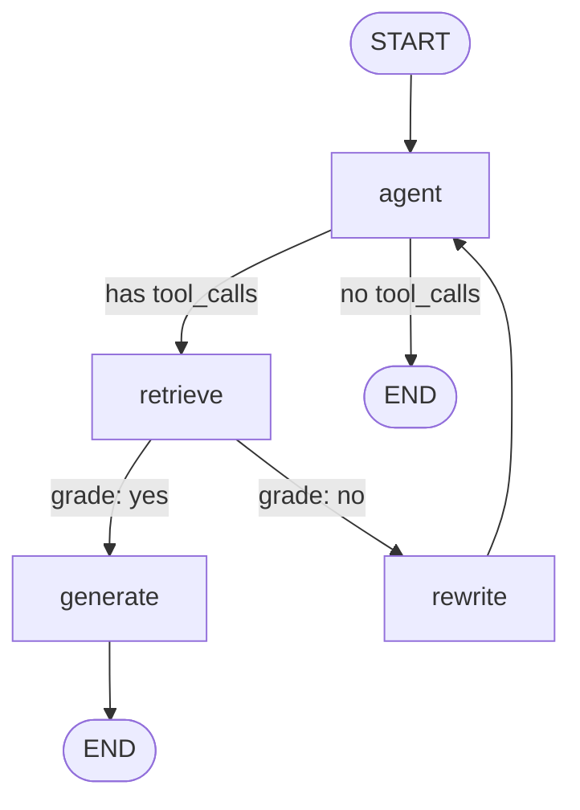

# Agentic RAG with LangGraph — Build & Workflow Guide

A reference for explaining this project in an interview: **how it was built, step
by step**, and **how the LangGraph workflow executes, step by step**.

---

## 1. One-paragraph summary

This is a **self-correcting RAG system**. A normal RAG pipeline is a straight line:
`retrieve → stuff context → generate`. If retrieval brings back weak documents,
the answer is weak. Here, an **LLM agent** decides *whether* to retrieve, a
**grader** node judges *whether the retrieved documents are actually good enough*,
and if they are not, a **rewrite** node reformulates the query and the agent tries
again. That decision-making loop is what makes it "agentic," and **LangGraph** is
the library that lets us express it as a graph with conditional branches and
cycles instead of a fixed chain.

---

## 2. Architecture at a glance

```
          ┌───────────────────────────────────────────────┐
          │                   main.py                      │
          │  load FAISS index → build tool → build graph   │
          │            → stream questions                  │
          └───────────────────────────────────────────────┘
                               │
        ┌──────────────────────┼───────────────────────┐
        ▼                      ▼                       ▼
   config/                 retriever.py            agents/
   - settings.py           - build/save/load       - graph.py   (wiring)
   - groq.py  (LLM)          FAISS index           - nodes.py   (agent/rewrite/generate)
   - openai.py (LLM)       - get_retriever_tool    - edges.py   (routing + grader)
   - embeddings.py (HF)
```

Directory tree:

```
src/
├── main.py                 # entry point: load index, run the graph on questions
├── build_db.py             # one-off script: build & persist the FAISS index
├── retriever.py            # ingest URLs → FAISS; save/load; wrap as a retriever tool
├── config/
│   ├── settings.py         # env vars: provider, model, embedding model, paths, URLs
│   ├── openai.py           # get_openai_llm() + get_llm() provider router
│   ├── groq.py             # get_groq_llm()  (Groq = fast, free-tier inference)
│   └── embeddings.py       # get_embeddings() → local sentence-transformers model
└── agents/
    ├── graph.py            # GraphState + build_graph(): nodes, edges, compile
    ├── nodes.py            # agent, rewrite, generate node factories
    └── edges.py            # route_after_agent(), create_grade_documents()
```

---

## 3. How the project was built — step by step

Follow these in order; each step maps to a file you can open and explain.

### Step 1 — Project scaffold

- `pyproject.toml` with `requires-python = ">=3.10"` and dependencies:
  `langchain`, `langchain-openai`, `langchain-community`, `langgraph`,
  `langchain-groq`, `langchain-huggingface`, `sentence-transformers`,
  `faiss-cpu`, `beautifulsoup4`, `tiktoken`, `python-dotenv`.
- `src/` as a package (`hatchling` build, `packages = ["src"]`).
- `.gitignore` for `.env`, `__pycache__/`, `.venv/`, and the persisted
  `faiss_index/`.

### Step 2 — Configuration layer (`src/config/`)

The goal: **no secrets or model names hard-coded in logic**. Everything comes
from `.env` via `settings.py`.

- `settings.py` — calls `load_dotenv()` once, then reads:
  - `LLM_PROVIDER` — `"openai"` or `"groq"` (default `openai`)
  - `GROQ_API_KEY`, `GROQ_MODEL` (default `openai/gpt-oss-20b`)
  - `OPENAI_API_KEY`
  - `EMBEDDING_MODEL` (default `sentence-transformers/all-MiniLM-L6-v2`)
  - `FAISS_INDEX_PATH` (default `faiss_index`)
  - `SOURCE_URLS` — the documents to ingest
  - Validates that the key for the selected provider is present, and raises
    early with a clear message if not.

- `groq.py` — `get_groq_llm()` returns `ChatGroq(model=..., temperature=0,
  api_key=...)`. Groq is an inference host with an OpenAI-compatible API and a
  generous free tier, so it is the cheap default for development.

- `openai.py` — `get_openai_llm()` returns `ChatOpenAI(...)`. `get_llm()` is the
  **router**: it looks at the `provider` argument, else `LLM_PROVIDER`, and
  returns the right client. Every node calls `get_llm()` and never cares which
  vendor is behind it.

- `embeddings.py` — `get_embeddings()` returns a **local**
  `HuggingFaceEmbeddings` model (`all-MiniLM-L6-v2`, 384-dim, normalized). It
  runs on CPU, needs no API key, and downloads once from HuggingFace. This is
  why the app can run with only a Groq key.

- `__init__.py` re-exports the public names so callers do `from .config import
  get_llm, get_embeddings, SOURCE_URLS`.

### Step 3 — Retrieval & vector store (`src/retriever.py`)

- `build_vectorstore(urls)`:
  1. `WebBaseLoader(urls).load()` — fetch and parse the pages (BeautifulSoup).
  2. `RecursiveCharacterTextSplitter(chunk_size=1000, chunk_overlap=200)` —
     split into overlapping chunks so a semantic unit isn't cut in half.
  3. `FAISS.from_documents(splits, get_embeddings())` — embed every chunk and
     put the vectors in an in-memory FAISS index.
- `save_vectorstore()` / `load_vectorstore()` — `FAISS.save_local()` writes
  `index.faiss` + `index.pkl`; `load_local(..., allow_dangerous_deserialization=True)`
  reads them back. (The flag is required because the pickle side is arbitrary
  Python; it is safe here because *we* produced the file.)
- `get_vectorstore(rebuild=False)` — **load from disk if `faiss_index/` exists,
  otherwise build and save.** This is the "don't re-embed every run" behavior.
- `get_retriever_tool(vectorstore)` — `create_retriever_tool()` wraps
  `vectorstore.as_retriever(search_kwargs={"k": 4})` into a LangChain **tool**
  named `retrieve_documents` with a description the LLM reads to decide when to
  call it.

### Step 4 — Separate DB builder (`src/build_db.py`)

A tiny CLI so the index is a **build artifact**, not something recomputed on
startup:

```bash
python -m src.build_db            # build if missing
python -m src.build_db --rebuild  # force rebuild (sources or embedding model changed)
python -m src.build_db --url URL  # override sources (repeatable)
```

It imports `build_vectorstore` + `save_vectorstore` from `retriever.py`, so
there is one code path for building.

### Step 5 — Graph state (`src/agents/graph.py`)

```python
class GraphState(TypedDict):
    messages: Annotated[list, add_messages]
```

- The **entire state is a list of chat messages** (`HumanMessage`, `AIMessage`,
  `ToolMessage`).
- `Annotated[list, add_messages]` sets a **reducer**: when a node returns
  `{"messages": [x]}`, LangGraph *appends* `x` (and de-dupes by message id)
  instead of overwriting. Nodes therefore only ever return the *new* messages
  they produced.

### Step 6 — Nodes (`src/agents/nodes.py`)

Each node is a factory returning a `def node(state) -> {"messages": [...]}`.

- **`agent`** — `llm.bind_tools(tools)` then `.invoke(state["messages"])`.
  The model either answers directly (plain `AIMessage`) or emits an `AIMessage`
  with `tool_calls` asking to run `retrieve_documents`.
- **`rewrite`** — takes the *original* question (`messages[0].content`), asks the
  LLM to make it more search-friendly (precise terms, keywords), and returns a
  **new `HumanMessage`** with the rewritten query.
- **`generate`** — scans the message list for the one carrying retrieved text,
  builds a `Context: … / Question: …` prompt, and returns the final `AIMessage`
  answer grounded in that context.

### Step 7 — Edges & the grader (`src/agents/edges.py`)

- **`route_after_agent(state)`** — pure Python, no LLM. If the last message has
  non-empty `tool_calls` → `"retrieve"`, else → `"end"`.
- **`create_grade_documents()`** — returns `grade_documents(state)`, which:
  - uses `llm.with_structured_output(GradeDocuments)` where `GradeDocuments` is a
    Pydantic model with `binary_score: "yes"|"no"` and `reasoning: str`;
  - feeds the **original question** + the **first 500 chars of the retrieved
    content** into a deliberately *strict* grading prompt;
  - returns `"generate"` if `binary_score == "yes"`, else `"rewrite"`.
  - Structured output means we get a typed object back, not free text we'd have
    to parse.

### Step 8 — Wire the graph (`build_graph`)

```python
workflow = StateGraph(GraphState)
workflow.add_node("agent",    agent_node)
workflow.add_node("retrieve", ToolNode(tools))   # prebuilt: runs tool_calls
workflow.add_node("rewrite",  rewrite_node)
workflow.add_node("generate", generate_node)

workflow.set_entry_point("agent")

workflow.add_conditional_edges("agent", route_after_agent,
                               {"retrieve": "retrieve", "end": END})
workflow.add_conditional_edges("retrieve", grade_documents_func,
                               {"generate": "generate", "rewrite": "rewrite"})
workflow.add_edge("rewrite", "agent")   # loop back and try again
workflow.add_edge("generate", END)

app = workflow.compile()
```

- `ToolNode` is a LangGraph prebuilt: it reads `tool_calls` off the last
  `AIMessage`, executes the matching tools, and appends `ToolMessage`s.
- `add_conditional_edges(source, fn, mapping)` — `fn(state)` returns a string
  key; `mapping` translates that key to the next node.
- `rewrite → agent` is the **cycle** that a plain LChain can't express.

### Step 9 — Entry point (`src/main.py`)

1. `get_vectorstore()` — load (or first-time build) the FAISS index.
2. `get_retriever_tool(vs)` → `tools = [retriever_tool]`.
3. `app = build_graph(tools)`.
4. For each question: `app.stream({"messages": [HumanMessage(content=q)]})` and
   print each node's output as it runs; the last message is the final answer.

---

## 4. How the LangGraph workflow runs — step by step

### The graph



### Trace A — documents are good (happy path)

1. **Input**: `messages = [HumanMessage("What are the key components of an AI agent?")]`.
   Entry point is `agent`.
2. **`agent`**: LLM sees the tool `retrieve_documents`, decides it needs external
   info, returns `AIMessage(content="", tool_calls=[retrieve_documents(query=...)])`.
   State messages: `[Human, AI(tool_call)]`.
3. **`route_after_agent`**: last message has `tool_calls` → route key `"retrieve"`.
4. **`retrieve`** (`ToolNode`): runs the retriever, appends
   `ToolMessage(content="<top-4 chunks concatenated>")`.
   State: `[Human, AI(tool_call), Tool(docs)]`.
5. **`grade_documents`**: builds the strict prompt from `messages[0].content`
   (original question) + first 500 chars of the `ToolMessage`. Structured LLM
   returns `GradeDocuments(binary_score="yes", reasoning="...")` → route key
   `"generate"`.
6. **`generate`**: finds the message with the retrieved text, prompts the LLM
   with `Context + Question`, returns `AIMessage("<grounded answer>")`.
7. **`generate → END`**. `app.stream` stops. Final answer = last message.

### Trace B — documents are weak (self-correction loop)

1–4. Same as above, but the retrieved chunks are only tangentially related.
5. **`grade_documents`**: returns `binary_score="no"` → route key `"rewrite"`.
6. **`rewrite`**: takes the *original* question, asks the LLM to rewrite it into
   a sharper search query, returns a **new** `HumanMessage("<rewritten query>")`.
   State: `[Human(orig), AI(tool_call), Tool(docs), Human(rewritten)]`.
7. **`rewrite → agent`** (unconditional edge). The agent now sees the rewritten
   question as the latest turn, issues a fresh `retrieve_documents` call with
   better terms.
8. Loop repeats: `retrieve → grade`. If `"yes"` → `generate → END`. If still
   `"no"` → `rewrite → agent` again.
9. The loop is bounded only by LangGraph's default **`recursion_limit` (25
   super-steps)**; hitting it raises `GraphRecursionError`. (See "improvements".)

### Trace C — no retrieval needed

1. **Input**: `HumanMessage("Hi, who are you?")`.
2. **`agent`**: LLM answers directly, `AIMessage` has **no** `tool_calls`.
3. **`route_after_agent`**: → `"end"` → `END`. One LLM call, no retrieval.

### Why `messages[0]` is always the original question

`add_messages` only appends. `rewrite` adds a new `HumanMessage` at the end; it
never touches index 0. So `grade_documents` and `generate`, which both read
`messages[0].content`, always grade/answer the user's *real* question even after
several rewrites.

---

## 5. Interview talking points

**Why LangGraph instead of a LangChain chain / LCEL?**
Chains are DAGs — no cycles, no first-class conditional branching on runtime
state. The "grade → rewrite → retrieve again" loop *is* a cycle. LangGraph gives
you an explicit state machine (nodes + typed state + conditional edges +
cycles), streaming of intermediate steps, and a place to add checkpointing /
human-in-the-loop later.

**What makes it "agentic" rather than plain RAG?**
Two LLM-driven control decisions: (1) the `agent` node decides *whether* to
retrieve at all; (2) the grader decides *whether the evidence is sufficient* and
can send the system back to try again. Plain RAG always retrieves once and always
answers.

**What is the reducer (`add_messages`) doing?**
It's the merge function for the `messages` key. Nodes return only their new
messages; LangGraph appends them, de-duplicates by id, and supports updating a
message by re-emitting it with the same id. Without it, each node would have to
return the whole history and could clobber it.

**Why `with_structured_output` for the grader?**
It forces the model to return a validated `GradeDocuments` Pydantic object
(`binary_score`, `reasoning`) via function-calling/JSON-schema, so routing logic
is `grade.binary_score == "yes"` instead of brittle string parsing.

**Why Groq + local embeddings?**
Groq hosts open models behind an OpenAI-compatible API with a free tier — fast,
free iteration. Embeddings use a local `sentence-transformers` model, so the RAG
pipeline needs *no* paid API at all. `get_llm()` still lets you switch to OpenAI
with one env var.

**Why persist FAISS in a separate builder?**
Embedding the corpus is the slow, deterministic part. `build_db.py` makes the
index a build artifact (`faiss_index/`, git-ignored); `main.py` just loads it.
Rebuild only when `SOURCE_URLS` or `EMBEDDING_MODEL` change.

**Known weaknesses / what I'd improve**
- **No explicit loop cap.** Add a `tries` counter to the state and force
  `generate` (answer with best-effort + a caveat) after N rewrites, instead of
  relying on `recursion_limit`.
- **Fragile context extraction** in `generate` (substring match on
  `"Retrieved documents"`/`"Document"`). Better: read the most recent
  `ToolMessage` by type.
- **Grader sees only 500 chars** of the retrieved text — cheap but can
  mis-grade. Could grade per-chunk and filter.
- **`WebBaseLoader` keeps nav/boilerplate**; a cleaner extractor (readability,
  trafilatura) would improve chunk quality.
- **No checkpointer** — add `MemorySaver`/a DB checkpointer for multi-turn
  conversations and resumability.
- **No citations** surfaced in the final answer.
- **Single tool** — a real agent would also have web-search fallback when the
  local KB fails twice.

**How would you add multi-turn memory?**
Compile with a checkpointer (`workflow.compile(checkpointer=MemorySaver())`) and
pass a `thread_id` in the config; state (the message list) is then persisted per
thread between `invoke`/`stream` calls.

---

## 6. Quick commands

```bash
uv venv && uv pip install -e .        # install
cp .env.example .env                  # then fill GROQ_API_KEY
python -m src.build_db                # build the FAISS index once
python -m src.main                    # CLI: run the agent on the sample questions
streamlit run streamlit_app.py       # UI: chat + per-node reasoning trace
python -m src.build_db --rebuild      # after changing sources / embedding model
```
